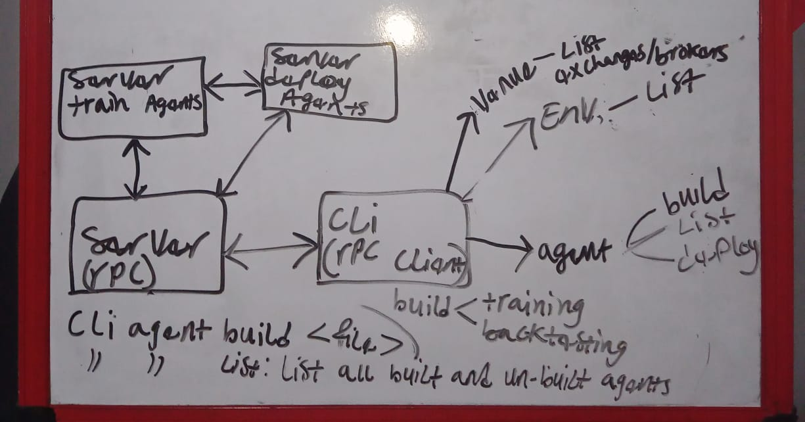

# Architecture

## Components

- **Server (Train Agents):** Responsible for training agents.
- **Server (Deploy Agents):** Handles agent deployment to various environments.
- **Server (RPC):** Acts as an RPC server for communication between the CLI and other servers.
- **CLI (RPC Client):** The command-line interface which interacts with the RPC server.
- **Agent:** The core component representing a trading agent.

## Interactions

- The CLI interacts with the RPC server using JSON-RPC calls.
- The RPC server routes requests to the appropriate server (Train Agents, Deploy Agents).
- Agents can be built, listed, and deployed through the CLI.
- Training and backtesting of agents occur on the "Train Agents" server.

## Documentation

The TradeFlow system employs a client-server architecture, utilizing JSON-RPC for communication between the CLI and backend services. The system is comprised of several key components, each with distinct responsibilities.

### Components

#### CLI (Command-Line Interface)

- Serves as the primary interaction point for users.
- Provides commands for building, listing, deploying, and managing agents.
- Communicates with the RPC server using JSON-RPC.

#### Main RPC Server

- Acts as a central communication hub.
- Handles incoming requests from the CLI.
- Routes requests to appropriate backend services.
- Returns responses to the CLI.

#### Train Agents Server

- Responsible for training agents using provided data and algorithms.
- Stores trained agent models.

#### Deploy Agents Server

- Handles agent deployment to different environments (e.g., live, staging, testing).
- Manages agent lifecycle.

### Data Flow

1. The user interacts with the CLI to perform actions (build, list, deploy, etc.).
2. The CLI sends a JSON-RPC request to the RPC server.
3. The RPC server processes the request and routes it to the appropriate backend service.
4. The backend service performs the requested operation.
5. The RPC server returns the result to the CLI.

#### Data Layer

### Communication Protocol

JSON-RPC is used for communication between the CLI and the RPC server. This protocol provides a standardized way for client-server communication, allowing for efficient data exchange and error handling.

### Additional Considerations

- **Security:** Implement appropriate security measures to protect sensitive data and prevent unauthorized access.
- **Scalability:** Design the system to handle increasing workloads and data volumes.
- **Error Handling:** Implement robust error handling mechanisms to gracefully handle exceptions.
- **Performance:** Optimize communication and processing to ensure efficient operation.

### Future Enhancements

- Consider adding a web-based UI for enhanced user experience.
- Explore distributed computing for improved performance and scalability.
- Implement advanced monitoring and logging for system health and troubleshooting.

By following this architecture, TradeFlow can effectively manage the lifecycle of trading agents, from development to deployment.
