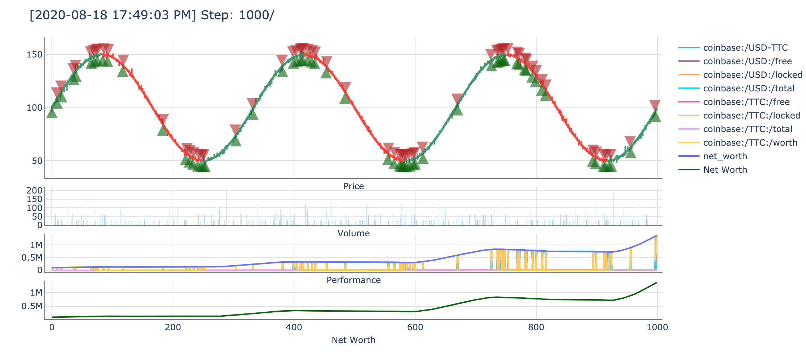

# Renderer

The `Renderer` is the component of the `TradingEnvironment` that lets us peek into the thoughts and actions of an agent. There are many different ways to render this type of environment, but all you need to do in order to get a different rendering is to subclass `Renderer` and fill in the `render` method. If you want to see more on how to make a `Renderer` from scratch check out the tutorial for using `ray` with TradeFlow.

## Default

The `default` renderers are made to work with any instance of the `BaseRenderer`
class.

### Screen Logger

Logs the records of the environment to the screen for the user to see.

### File Logger

Logs the records of the environment to a specified file.

### Plotly Trading Chart

Uses plotly to make a rendering of the environment. This renderer only works for when the action scheme involves trading one asset. The data required for the `render_feed` must include the date, open, high, low, close, and volume of the instrument being traded.

 **References** 

- https://plot.ly/python-api-reference/generated/plotly.graph_objects.Figure.html
- https://plot.ly/python/figurewidget/
- https://plot.ly/python/subplots/
- https://plot.ly/python/reference/#candlestick
- https://plot.ly/python/#chart-events

